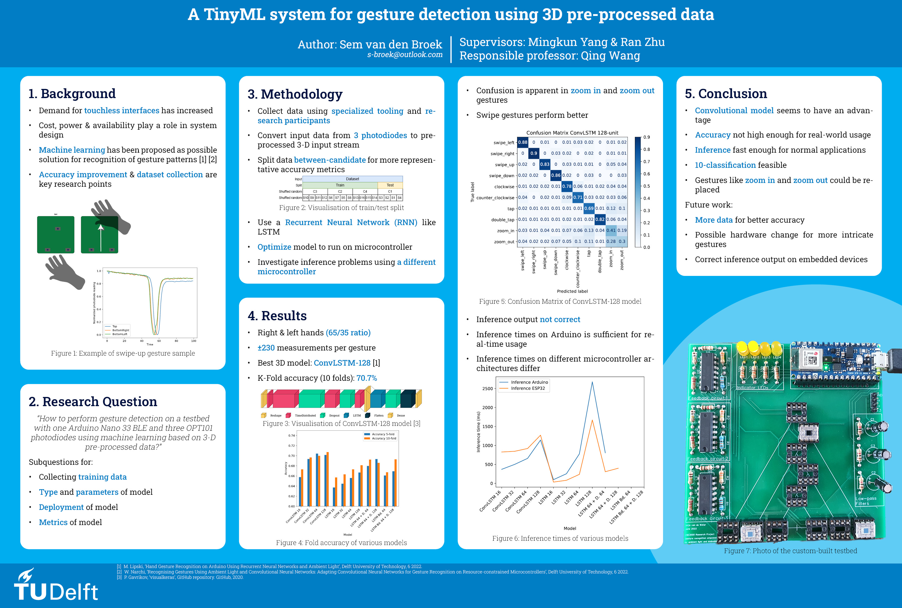

# A TinyML system for gesture detection using 3D pre-processed data
This codebase was created as partial fulfillment for the TU Delft CSE Bachelor 
[Research Project](https://github.com/TU-Delft-CSE/Research-Project) 2023/Q4. The presented codebase
in Python, C and C++ was used to perform analysis on various machine learning models as well as to create a working
deployment to the Arduino Nano 33 BLE microcontroller.

Part of the complete research are also:
- The [shared repository](https://github.com/arnedebeer/CSE3000-DataCollection) in which updated data collection code 
has been created, as well as where samples collected from research participants are stored.
- My Bachelor Thesis found here: https://repository.tudelft.nl/islandora/object/uuid:a0358845-34c0-4169-94a1-680e1bb18dff
- An accompanying poster

## Abstract
Visible light sensing is a field of research that creates new possibilities for human-computer interaction. This research shows the viability of designing a system for detecting hand gestures using a cost-effective detection circuit employing 3 light-sensitive photodiodes. The way this research shows viability is by developing a machine-learning model that works on 3D-structured sensor data that is able to distinguish 10 different gestures and deploying the model on a standalone Arduino Nano 33 BLE microcontroller controlling the system. Using a combination of Convolutional Neural Networks and Recurrent Neural Networks it is possible to deploy a model called ConvLSTM-128 that achieves an accuracy of 70% on a dataset of limited size. This research acknowledges that the achieved accuracy is not suitable for real-world use, but concludes by outlining steps that could help future research in increasing the accuracy. Furthermore, an analysis of the 10 gestures shows that in order to improve accuracy, the way some gestures are performed might need alteration. Finally, a model size of around 140Kb and an inference time of 660ms show that this model is compact and fast enough to be deployed in real-world applications.

## Project Structure
- `ml-dev` This folder contains all the code necessary to perform model training and analysis using Python and TensorFlow
- `ml-micro` This folder contains the code to deploy models to the Arduino microcontroller using 
- `data` This folder is left empty. The constructed dataset should be inserted here in order for model training to work
- `models` Models in multiple file formats that are currently trained on a real dataset
- `results` Analysis data from the models, including confusion matrices, full training history and k-fold cross-validation
metrics.